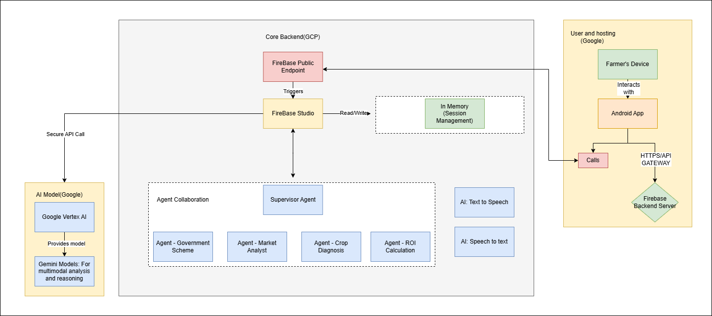

# 🌼 Farmer AI Assistant - System Architecture

This project aims to provide **AI-powered agricultural assistance** to farmers through a mobile app using Google Cloud (Firebase), Vertex AI, and multimodal Gemini models. The system supports multiple agents specialized in various farming domains, and includes real-time voice interactions through speech-to-text and text-to-speech modules.

---

## 🔧 System Components Overview

### 🟨 User and Hosting (Google)
- **Farmer’s Device:** Entry point for farmers via an Android App.
- **Android App:** User-friendly mobile interface for farmers to interact with the AI assistant.
- **Calls:** API requests sent from the app to the backend server via secure HTTPS.
- **Firebase Backend Server:** Processes incoming requests and communicates with the core backend components via Firebase API Gateway.

---

### 🟩 Core Backend (GCP - Google Cloud Platform)
- **Firebase Public Endpoint:** Acts as a trigger for Firebase Studio.
- **Firebase Studio:** Orchestrates logic flow, agent collaboration, and communication with AI models. It also handles:
  - Triggering AI agent workflows.
  - Reading/Writing to memory (e.g., for session context).
- **In-Memory Session Management:** Manages user sessions for real-time interaction and context awareness.

---

### 🤖 AI Agents and Collaboration
- **Supervisor Agent:** Controls and coordinates specialized sub-agents.
- **Specialized Agents:**
  - `Agent - Government Scheme:` Provides information on relevant government farming schemes.
  - `Agent - Market Analyst:` Gives market price insights and trends.
  - `Agent - Crop Diagnosis:` Diagnoses crop health using multimodal inputs (text, image, etc.).
  - `Agent - ROI Calculation:` Helps estimate Return on Investment based on crop and cost data.

---

### 🧠 AI Model (Google Vertex AI)
- **Google Vertex AI:** Hosts and serves LLM models.
- **Gemini Multimodal Models:** Used for multimodal reasoning such as analyzing images, text, and speech to generate responses and actions.

---

### 🗣️ Speech Support
- **AI: Text to Speech:** Converts AI-generated responses to audio for the farmer.
- **AI: Speech to Text:** Transcribes farmer’s spoken questions to text for processing.

---

## 🔒 Security
- **Secure API Call:** All communications between Firebase and Vertex AI are secured.
- **HTTPS Gateway:** Ensures encrypted communication between the app and backend services.

---

## 🧹 Use Case Flow
1. Farmer interacts with the **Android App** (via voice or text).
2. Request is routed via **Firebase Backend Server** to **Firebase Studio**.
3. Studio triggers a **Supervisor Agent**, which delegates to appropriate sub-agents.
4. If needed, data is passed to **Google Vertex AI** for reasoning or multimodal processing.
5. The response is sent back to the app, optionally converted to speech.
6. The farmer receives insights, diagnosis, or scheme suggestions in their language.

---

## 📊 Benefits
- Personalized crop recommendations.
- Government scheme awareness.
- Real-time voice-enabled assistant.
- Market insights and ROI calculation.
- Scalable and secure backend powered by GCP and Vertex AI.

---

## 📚 Documentation
- API and Module Reference: see `docs/API.md`

